# comment-service 全接口数据流向报告

本文档用于面试复盘、压测定位和代码走读。结构按三类角色拆分：学生端、助教端、运营端。每个角色内部按照复杂度从高到低排列，先讲聚合查询、搜索、并发写，再讲普通列表和简单写操作。

这里的“数据流向”统一写到方法级别：入口请求进入 Kratos 中间件后，先到 `service`，再到 `biz`，最后到 `data`，并标明会访问 Redis、MySQL、Elasticsearch 的位置，以及最终返回的 proto 结构。

所有流程图使用 Mermaid 编写，在 GitHub、VS Code Markdown Preview、Typora 等支持 Mermaid 的 Markdown 工具中可以直接渲染。

## 0. 公共入口和返回结构

所有 HTTP/gRPC 请求都会先经过统一中间件：

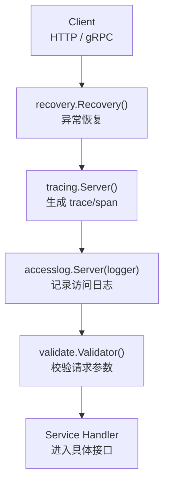

中间件输出：

```text
event=access
kind=http/grpc
operation=/api.comment.v1.StudentService/GetPostDetailStudent
request_id=<x-request-id 或 trace_id>
trace_id=<OpenTelemetry trace id>
span_id=<OpenTelemetry span id>
code=200/400/500
reason=<错误原因>
latency_ms=<耗时毫秒>
```

通用 DTO：

| DTO | 字段 |
| --- | --- |
| `PostDTO` | `post_id`, `author_id`, `title`, `content`, `status`, `like_count`, `comment_count`, `created_at` |
| `CommentDTO` | `comment_id`, `post_id`, `student_id`, `content`, `visible_status`, `audit_status`, `created_at`, `replies[]` |
| `ReplyDTO` | `comment_reply_id`, `comment_id`, `tutor_id`, `content`, `created_at` |

通用转换方法：

```text
postDTOFromModel(*model.Post) -> *pb.PostDTO
commentDTOFromModel(*model.StudyComment, []*model.StudyCommentReply) -> *pb.CommentDTO
replyDTOsFromModels([]*model.StudyCommentReply) -> []*pb.ReplyDTO
commentDTOsFromModels(comments, repliesByCommentID) -> []*pb.CommentDTO
collectCommentIDs(comments) -> []int64
```

缓存和存储分工：

| 存储 | 作用 |
| --- | --- |
| MySQL | 强一致事实源，负责帖子、评论、回复、点赞、审核状态 |
| Redis | 对象缓存、列表缓存、搜索缓存、空值缓存、Bloom Filter、点赞短锁 |
| Elasticsearch | 帖子和评论搜索列表，不作为详情、删除、审核、点赞的事实源 |

## 1. 学生端接口

学生端包含 `StudentService` 的 8 个接口，加上 `SearchService` 中属于学生端的 2 个搜索接口，共 10 个接口。

复杂度顺序：

1. `GetPostDetailStudent`：帖子详情聚合，访问帖子、评论、回复，涉及 Redis/MySQL/Bloom/singleflight。
2. `SearchStudentPosts`：帖子搜索，直接访问 ES，并在返回前补 `post_counter` 和 Redis 计数 delta。
3. `SearchStudentComments`：评论搜索，访问 Redis 搜索缓存和 ES，并带学生端可见性边界。
4. `LikePost` / `UnlikePost`：并发写，涉及 Redis 短锁、MySQL 关系写、Redis delta 和异步计数落库。
5. `CreateComment`：写评论，涉及 MySQL 事务、Bloom、帖子缓存和列表缓存失效。
6. `DeleteMyComment`：权限校验 + 软删除 + 条件更新 + 评论数扣减。
7. `GetCommentDetailStudent`：评论详情聚合，访问评论、回复、帖子。
8. `ListPostCommentsStudent` / `ListMyComments`：普通分页列表，走 Redis 短 TTL 列表缓存和 MySQL。

### 1.1 GetPostDetailStudent：学生查看帖子详情

接口：

```text
GET /v1/student/posts/{post_id}
StudentService.GetPostDetailStudent(GetPostDetailRequest) returns (GetPostDetailReply)
```

请求字段：

```text
GetPostDetailRequest
  post_id
  user_id
  comment_page_num
  comment_page_size
```

数据流向流程图：

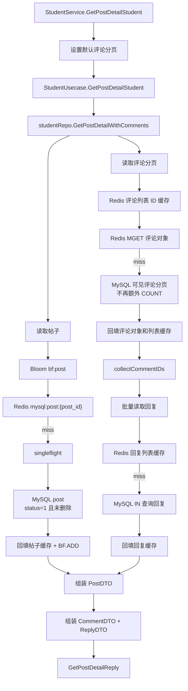

返回结构：

```text
GetPostDetailReply
  post: PostDTO
  comments[]: CommentDTO
    replies[]: ReplyDTO
  total_comments
```

设计要点：

- 详情页不走 ES，因为详情涉及最新状态、评论可见性、点赞数、评论数。
- 帖子对象使用 Bloom + Redis + singleflight + MySQL，防穿透和击穿。
- 评论列表使用短 TTL 缓存，避免复杂精准失效。
- 回复使用批量查询，避免一页评论触发 N+1。

### 1.2 SearchStudentPosts：学生搜索帖子

接口：

```text
GET /v1/student/search/posts
SearchService.SearchStudentPosts(SearchStudentPostsRequest) returns (SearchPostsReply)
```

请求字段：

```text
SearchStudentPostsRequest
  keyword
  tutor_id
  page_num
  page_size
```

数据流向流程图：

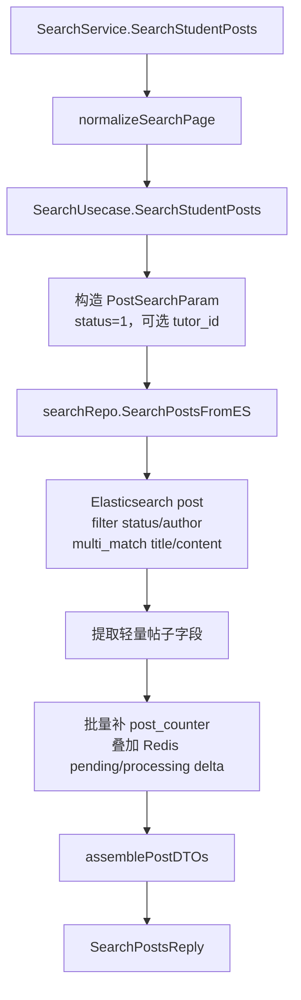

返回结构：

```text
SearchPostsReply
  total
  items[]: PostDTO
```

设计要点：

- 学生搜索只允许 `status=1` 的已发布帖子，权限边界在 biz 层写死。
- 搜索列表直接从 ES 返回轻量字段，避免搜索结果再 N 次回源 MySQL。
- 搜索结果短 TTL 缓存，接受短暂最终一致。
- 点击详情后仍回到 MySQL/Redis 链路。

### 1.3 SearchStudentComments：学生搜索评论

接口：

```text
GET /v1/student/search/comments
SearchService.SearchStudentComments(SearchStudentCommentsRequest) returns (SearchCommentsReply)
```

请求字段：

```text
SearchStudentCommentsRequest
  keyword
  post_id
  page_num
  page_size
```

数据流向流程图：

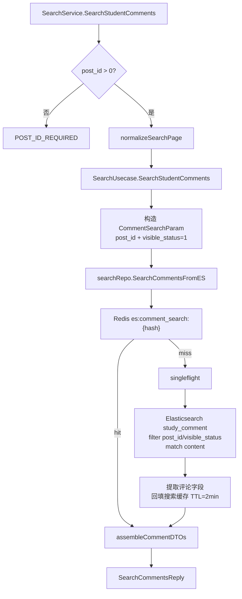

返回结构：

```text
SearchCommentsReply
  total
  items[]: CommentDTO
```

设计要点：

- 学生搜索评论必须限定 `post_id`，避免全站评论搜索造成权限边界不清晰。
- 学生只能看到 `visible_status=1` 的评论。
- 搜索结果当前不额外查询回复，`replies` 通常为空；详情页再聚合回复。

### 1.4 LikePost：学生点赞帖子

接口：

```text
POST /v1/student/posts/{post_id}/like
StudentService.LikePost(LikePostRequest) returns (LikePostReply)
```

请求字段：

```text
LikePostRequest
  student_id
  post_id
```

数据流向流程图：

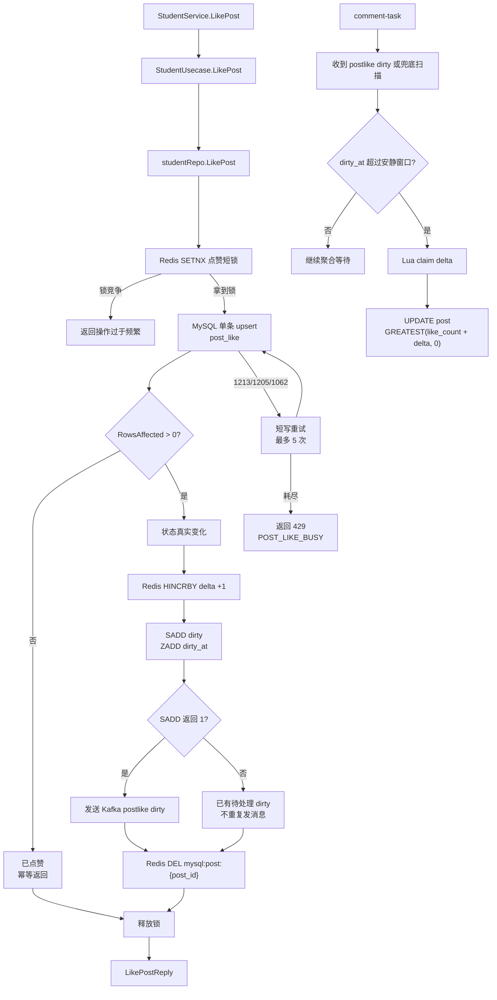

返回结构：

```text
LikePostReply {}
```

设计要点：

- 同一学生对同一帖子点赞必须幂等，重复点赞不重复加计数。
- Redis 短锁用于收敛同一 `student_id + post_id` 的并发写。
- 数据库唯一键 `uk_post_student(post_id, student_id)` 是最终兜底。
- 点赞关系写成功后不在请求内同步更新 `post.like_count`，只写 Redis delta。
- 只有状态真实变化才删除帖子缓存；Redis delta 入队失败会记录日志，后续通过 `post_like` 事实表校准。

点赞数一致性保证：

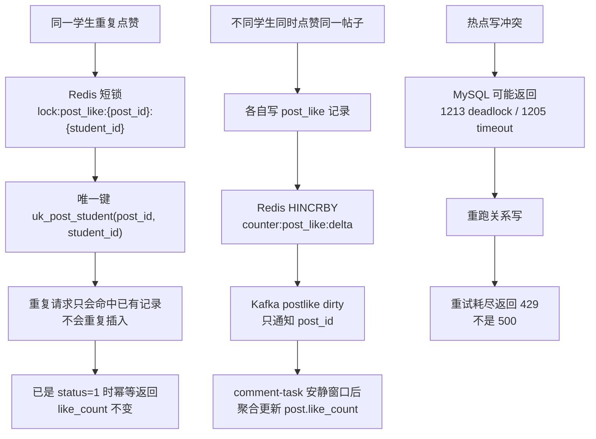

核心原则：

- `post_like` 是点赞关系事实表，`post.like_count` 是为了详情页高频读取而维护的冗余计数。
- 同一个学生对同一个帖子只能有一条 `post_like` 记录，由 `uk_post_student(post_id, student_id)` 唯一键兜底。
- 只有新插入或 `status=0 -> 1` 时，才认为点赞状态发生变化，才写 `delta=+1`。
- `post.like_count` 由 Redis delta、Kafka dirty 通知和 `comment-task` 后台任务最终一致推进。
- `queue:post_like:dirty_at` 记录最后变化时间，task 只处理超过安静窗口的帖子，避免热点写期间抢 `post` 行。
- 读详情时返回 `MySQL like_count + Redis pending delta`，异步落库窗口内也能尽量展示新计数。
- 热点帖子关系写仍可能遇到 `1213/1205`，代码会重试；重试耗尽按 429 业务繁忙返回，不再作为 500。

一致性校验 SQL：

```sql
SELECT
  p.post_id,
  p.like_count,
  COUNT(pl.id) AS active_like_count,
  p.like_count - COUNT(pl.id) AS diff
FROM post p
LEFT JOIN post_like pl
  ON pl.post_id = p.post_id
 AND pl.status = 1
WHERE p.post_id = ?
GROUP BY p.post_id, p.like_count;
```

判断标准：`diff = 0` 表示 `post.like_count` 与 `post_like` 有效点赞数一致。

如果出现极端 Redis 入队失败，`post_like` 事实表仍然可信，可以用该 SQL 定位差异，并通过校准任务修复 `post.like_count`。

### 1.5 UnlikePost：学生取消点赞

接口：

```text
DELETE /v1/student/posts/{post_id}/like
StudentService.UnlikePost(UnlikePostRequest) returns (UnlikePostReply)
```

请求字段：

```text
UnlikePostRequest
  student_id
  post_id
```

数据流向流程图：

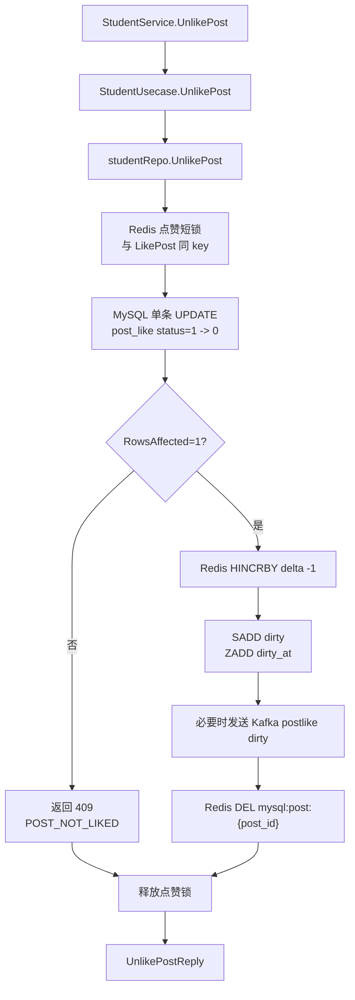

返回结构：

```text
UnlikePostReply {}
```

设计要点：

- 重复取消点赞不重复扣减。
- `RowsAffected=0` 返回 409，表示本来未点赞或已经取消过。
- 请求内不直接扣 `post.like_count`，只写 `delta=-1`。
- task 落库使用 `GREATEST(like_count + delta, 0)`，防止异常情况下扣成负数。
- 点赞和取消使用同一把锁，避免状态交叉写。

### 1.6 CreateComment：学生发表评论

接口：

```text
POST /v1/student/posts/{post_id}/comments
StudentService.CreateComment(CreateCommentRequest) returns (CreateCommentReply)
```

请求字段：

```text
CreateCommentRequest
  student_id
  post_id
  content
```

数据流向流程图：

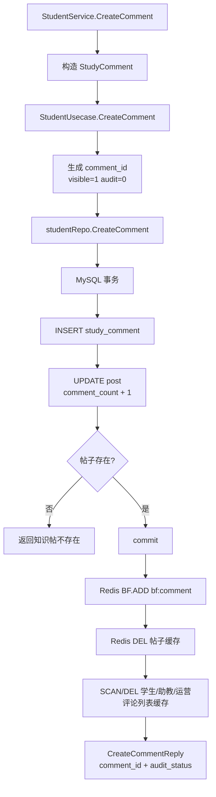

返回结构：

```text
CreateCommentReply
  comment_id
  audit_status
```

设计要点：

- 评论插入和 `post.comment_count + 1` 必须在同一个事务。
- 创建后只更新 Bloom，不主动写评论对象缓存。
- 帖子评论数变化，所以删除帖子对象缓存；评论对象缓存等下次读到 MySQL 后再回填。

### 1.7 DeleteMyComment：学生删除自己的评论

接口：

```text
DELETE /v1/student/comments/{comment_id}
StudentService.DeleteMyComment(DeleteMyCommentRequest) returns (DeleteMyCommentReply)
```

请求字段：

```text
DeleteMyCommentRequest
  student_id
  comment_id
```

数据流向流程图：

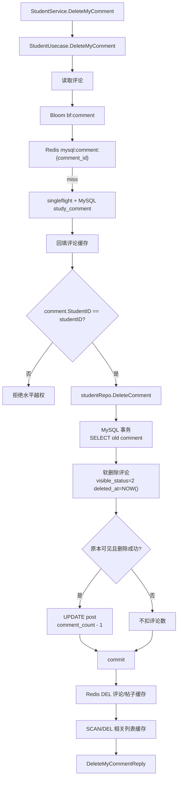

返回结构：

```text
DeleteMyCommentReply {}
```

设计要点：

- biz 层校验评论归属，防水平越权。
- data 层用 `deleted_at IS NULL` 和 `RowsAffected` 防重复删除。
- 只有原本可见且本次删除成功才扣评论数。

### 1.8 GetCommentDetailStudent：学生查看评论详情

接口：

```text
GET /v1/student/comments/{comment_id}
StudentService.GetCommentDetailStudent(GetCommentDetailRequest) returns (GetCommentDetailReply)
```

请求字段：

```text
GetCommentDetailRequest
  comment_id
```

数据流向流程图：

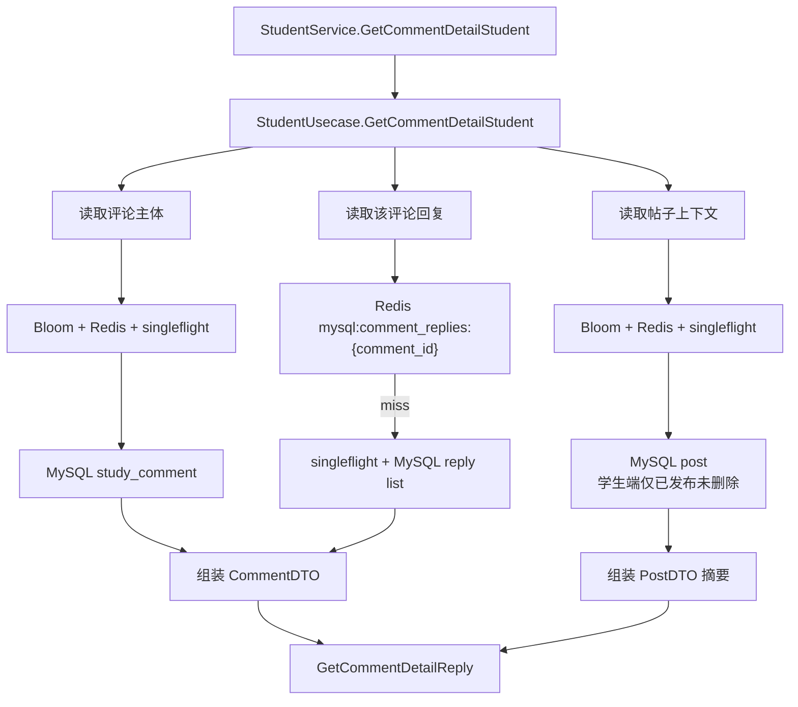

返回结构：

```text
GetCommentDetailReply
  comment: CommentDTO
    replies[]: ReplyDTO
  post_info: PostDTO
```

设计要点：

- 评论详情需要评论主体、回复列表、帖子上下文。
- 学生端帖子读取仍限制 `status=1 AND deleted_at IS NULL`。

### 1.9 ListPostCommentsStudent：学生查看帖子评论列表

接口：

```text
GET /v1/student/posts/{post_id}/comments
StudentService.ListPostCommentsStudent(ListPostCommentsRequest) returns (ListPostCommentsReply)
```

请求字段：

```text
ListPostCommentsRequest
  post_id
  page_num
  page_size
```

数据流向流程图：

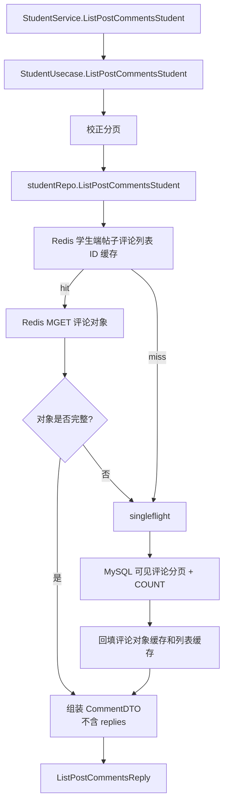

返回结构：

```text
ListPostCommentsReply
  items[]: CommentDTO
  total
```

设计要点：

- 普通列表不查回复，避免列表接口变重。
- 列表缓存不使用 Bloom，因为它缓存的是分页下的 comment_id 列表，不是单个 ID 查询。
- 评论对象缓存使用 `mysql:comment:{comment_id}`，列表命中后通过 MGET 批量读取对象。

### 1.10 ListMyComments：学生查看自己的评论列表

接口：

```text
GET /v1/student/comments
StudentService.ListMyComments(ListMyCommentsRequest) returns (ListMyCommentsReply)
```

请求字段：

```text
ListMyCommentsRequest
  student_id
  page_num
  page_size
```

数据流向流程图：

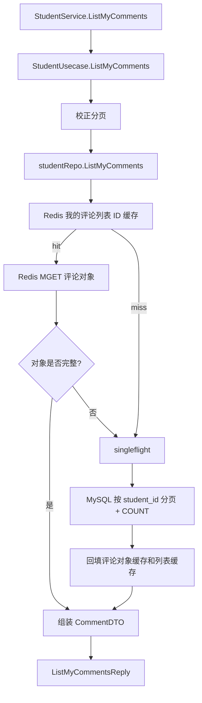

返回结构：

```text
ListMyCommentsReply
  items[]: CommentDTO
  total
```

## 2. 助教端接口

助教端包含 `TutorService` 的 10 个接口，加上 `SearchService` 中属于助教端的 2 个搜索接口，共 12 个接口。

复杂度顺序：

1. `GetPostDetailTutor`：帖子详情聚合，帖子 + 评论 + 批量回复。
2. `SearchTutorComments` / `SearchTutorPosts`：ES 搜索，带助教端权限边界。
3. `DeleteCommentTutor`：先查评论和帖子做权限校验，再软删除评论并扣评论数。
4. `ReplyComment` / `DeleteReply`：回复写链路，涉及评论/回复校验和缓存失效。
5. `UpdatePost` / `DeletePost`：帖子归属校验后修改或软删除。
6. `GetCommentDetailTutor`：评论详情聚合。
7. `ListTutorPosts` / `ListPostCommentsTutor`：普通分页列表。
8. `CreatePost`：简单写入，生成帖子 ID 和 Bloom。

### 2.1 GetPostDetailTutor：助教查看帖子详情

接口：

```text
GET /v1/tutor/posts/{post_id}
TutorService.GetPostDetailTutor(GetPostDetailRequest) returns (GetPostDetailReply)
```

数据流向流程图：

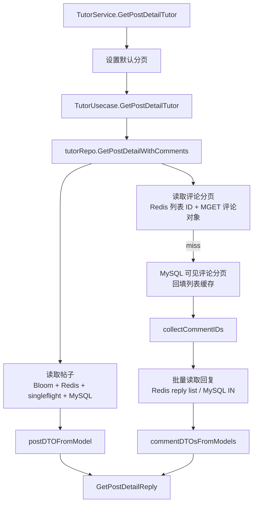

返回结构：

```text
GetPostDetailReply
  post: PostDTO
  comments[]: CommentDTO
    replies[]: ReplyDTO
  total_comments
```

注意：

- 当前 `GetPostDetailTutor` 没有显式校验 `post.author_id == tutor_id`，它更像“助教视角查看已发布帖子详情”。如果业务要求只能看自己的帖子，应在 biz 层补 `tutor_id` 并校验。

### 2.2 SearchTutorComments：助教搜索帖子下评论

接口：

```text
GET /v1/tutor/posts/{post_id}/comments/search
SearchService.SearchTutorComments(SearchTutorCommentsRequest) returns (SearchCommentsReply)
```

数据流向流程图：

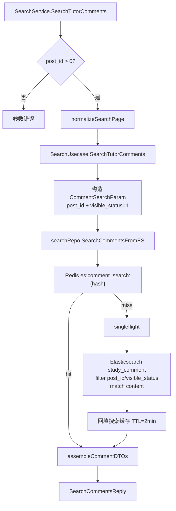

返回结构：

```text
SearchCommentsReply
  total
  items[]: CommentDTO
```

注意：

- 当前搜索接口只限定 `post_id`，没有额外校验该帖子是否属于当前助教。严格权限版本应先校验 `post.author_id == tutor_id`。

### 2.3 SearchTutorPosts：助教搜索自己的帖子

接口：

```text
GET /v1/tutor/search/posts
SearchService.SearchTutorPosts(SearchTutorPostsRequest) returns (SearchPostsReply)
```

数据流向流程图：

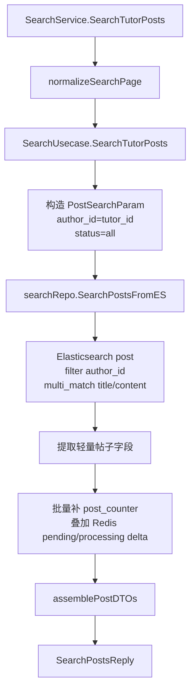

返回结构：

```text
SearchPostsReply
  total
  items[]: PostDTO
```

### 2.4 DeleteCommentTutor：助教删除自己帖子下的评论

接口：

```text
DELETE /v1/tutor/comments/{comment_id}
TutorService.DeleteCommentTutor(DeleteCommentTutorRequest) returns (DeleteCommentTutorReply)
```

请求字段：

```text
DeleteCommentTutorRequest
  tutor_id
  comment_id
```

数据流向流程图：

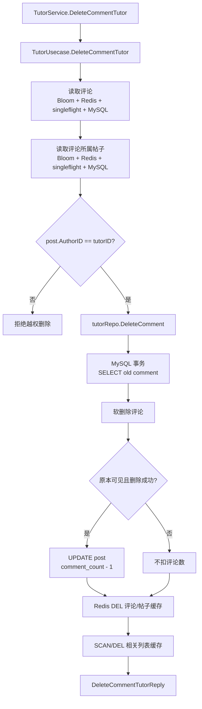

返回结构：

```text
DeleteCommentTutorReply {}
```

设计要点：

- biz 层校验助教只能删除自己帖子下的评论。
- data 层用条件更新兜底，避免学生和助教同时删除导致重复扣减。

### 2.5 ReplyComment：助教回复评论

接口：

```text
POST /v1/tutor/comments/{comment_id}/replies
TutorService.ReplyComment(ReplyCommentRequest) returns (ReplyCommentReply)
```

请求字段：

```text
ReplyCommentRequest
  tutor_id
  comment_id
  content
```

数据流向流程图：

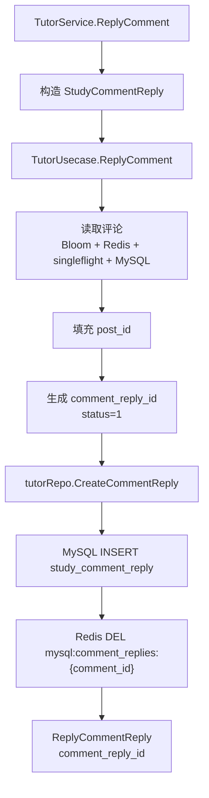

返回结构：

```text
ReplyCommentReply
  comment_reply_id
```

设计要点：

- 回复前先查评论，确保评论存在并拿到 `post_id`。
- 新增回复后精准删除该评论下回复列表缓存。

### 2.6 DeleteReply：助教删除自己的回复

接口：

```text
DELETE /v1/tutor/replies/{comment_reply_id}
TutorService.DeleteReply(DeleteReplyRequest) returns (DeleteReplyReply)
```

请求字段：

```text
DeleteReplyRequest
  tutor_id
  comment_reply_id
```

数据流向流程图：

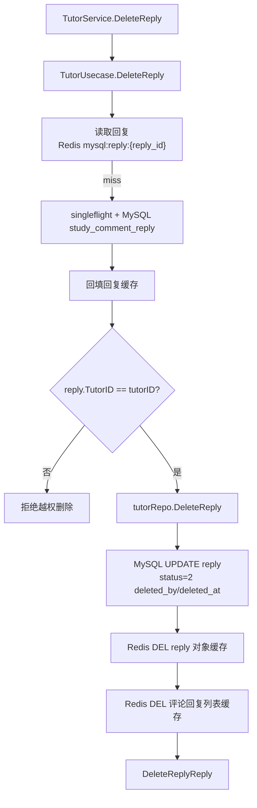

返回结构：

```text
DeleteReplyReply {}
```

设计要点：

- biz 层校验只能删除自己的回复。
- 删除回复不会影响 `post.comment_count`，只影响回复列表缓存。

### 2.7 UpdatePost：助教编辑帖子

接口：

```text
PUT /v1/tutor/posts/{post_id}
TutorService.UpdatePost(UpdatePostRequest) returns (UpdatePostReply)
```

请求字段：

```text
UpdatePostRequest
  tutor_id
  post_id
  title
  content
```

数据流向流程图：

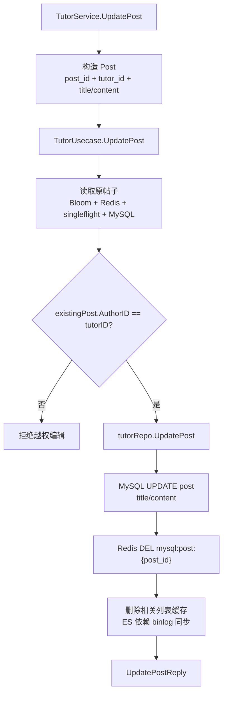

返回结构：

```text
UpdatePostReply {}
```

设计要点：

- 更新前查帖子并校验归属，防水平越权。
- 标题/内容变化会影响详情和搜索；详情缓存直接删除，ES 依赖 binlog 同步。

### 2.8 DeletePost：助教删除帖子

接口：

```text
DELETE /v1/tutor/posts/{post_id}
TutorService.DeletePost(DeletePostRequest) returns (DeletePostReply)
```

请求字段：

```text
DeletePostRequest
  tutor_id
  post_id
```

数据流向流程图：

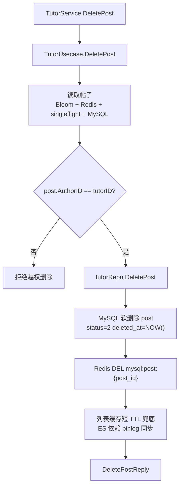

返回结构：

```text
DeletePostReply {}
```

设计要点：

- 帖子软删除，保留历史记录。
- 删除写路径只删除缓存，不主动写空值缓存；空值缓存由读路径在确认 DB 不存在后回填。

### 2.9 GetCommentDetailTutor：助教查看评论详情

接口：

```text
GET /v1/tutor/comments/{comment_id}
TutorService.GetCommentDetailTutor(GetCommentDetailRequest) returns (GetCommentDetailReply)
```

数据流向流程图：

```mermaid
flowchart TD
    A["TutorService.GetCommentDetailTutor"] --> B["TutorUsecase.GetCommentDetailTutor"]
    B --> C["读取评论\nBloom + Redis + singleflight + MySQL"]
    B --> D["读取回复列表\nRedis reply list / MySQL"]
    B --> E["读取帖子\nBloom + Redis + singleflight + MySQL"]
    C --> F["组装 CommentDTO"]
    D --> F
    E --> G["组装 PostDTO"]
    F --> H["GetCommentDetailReply"]
    G --> H
```

返回结构：

```text
GetCommentDetailReply
  comment: CommentDTO
  post_info: PostDTO
```

### 2.10 ListTutorPosts：助教查看自己帖子列表

接口：

```text
GET /v1/tutor/posts
TutorService.ListTutorPosts(ListTutorPostsRequest) returns (ListTutorPostsReply)
```

数据流向流程图：

```mermaid
flowchart TD
    A["TutorService.ListTutorPosts"] --> B["TutorUsecase.ListTutorPosts"]
    B --> C["tutorRepo.ListTutorPosts"]
    C --> D["normalizeTutorPage"]
    D --> E["Redis 助教帖子列表缓存"]
    E -->|hit| I["组装 PostDTO"]
    E -->|miss| F["singleflight"]
    F --> G["MySQL author_id 分页 + COUNT"]
    G --> H["Redis SET list cache TTL=2min"]
    H --> I
    I --> J["ListTutorPostsReply"]
```

返回结构：

```text
ListTutorPostsReply
  items[]: PostDTO
  total
```

注意：

- proto 有 `status` 字段，但当前 service/usecase 没有把 `status` 传入 repo 过滤，后续如果要按状态筛选，需要补参数链路。

### 2.11 ListPostCommentsTutor：助教查看帖子评论列表

接口：

```text
GET /v1/tutor/posts/{post_id}/comments
TutorService.ListPostCommentsTutor(ListPostCommentsRequest) returns (ListPostCommentsReply)
```

数据流向流程图：

```mermaid
flowchart TD
    A["TutorService.ListPostCommentsTutor"] --> B["TutorUsecase.ListPostCommentsTutor"]
    B --> C["tutorRepo.ListPostComments"]
    C --> D["Redis 帖子评论列表 ID 缓存"]
    D -->|hit| E["Redis MGET 评论对象"]
    D -->|miss| G["singleflight"]
    E --> F{"对象是否完整?"}
    F -->|是| J["组装 CommentDTO\n不含 replies"]
    F -->|否| G
    G --> H["MySQL 可见评论分页 + COUNT"]
    H --> I["回填评论对象缓存和列表缓存"]
    I --> J
    J --> K["ListPostCommentsReply"]
```

返回结构：

```text
ListPostCommentsReply
  items[]: CommentDTO
  total
```

### 2.12 CreatePost：助教发布帖子

接口：

```text
POST /v1/tutor/posts
TutorService.CreatePost(CreatePostRequest) returns (CreatePostReply)
```

请求字段：

```text
CreatePostRequest
  tutor_id
  title
  content
```

数据流向流程图：

```mermaid
flowchart TD
    A["TutorService.CreatePost"] --> B["构造 Post\ntutor_id + title + content"]
    B --> C["TutorUsecase.CreatePost"]
    C --> D["生成 post_id\nstatus=1"]
    D --> E["tutorRepo.CreatePost"]
    E --> F["MySQL INSERT post"]
    F --> G["Redis BF.ADD bf:post"]
    G --> H["删除相关列表缓存\n短 TTL 兜底"]
    H --> I["ES 依赖 binlog/同步任务"]
    I --> J["CreatePostReply\npost_id"]
```

返回结构：

```text
CreatePostReply
  post_id
```

## 3. 运营端接口

运营端包含 `OperatorService` 的 4 个接口，加上 `SearchService` 中属于运营端的 1 个搜索接口，共 5 个接口。

复杂度顺序：

1. `AuditComment`：审核状态机，并发条件更新，驳回时事务扣评论数。
2. `SearchOperatorComments`：运营审核工作台多条件 ES 检索。
3. `GetPostDetailOperator`：运营视角帖子详情，可看全部审核状态评论。
4. `GetCommentAuditDetail`：审核详情，评论 + 帖子上下文。
5. `ListPendingComments`：按审核状态分页列表。

### 3.1 AuditComment：运营审核评论

接口：

```text
POST /v1/operator/comments/{comment_id}/audit
OperatorService.AuditComment(AuditCommentRequest) returns (AuditCommentReply)
```

请求字段：

```text
AuditCommentRequest
  operator_id
  comment_id
  action
  manual_review_reason
```

数据流向流程图：

```mermaid
flowchart TD
    A["OperatorService.AuditComment"] --> B["OperatorUsecase.AuditComment"]
    B --> C{"action 是通过或驳回?"}
    C -->|否| X["参数错误"]
    C -->|是| D["读取评论\nBloom + Redis + singleflight + MySQL"]
    D --> E{"audit_status == 0?"}
    E -->|否| Y["已审核或不存在"]
    E -->|是| F{"action"}

    F -->|通过| G["ApproveComment"]
    G --> H["MySQL 条件更新\naudit_status=1"]
    H --> I["Redis DEL 评论缓存\n删除审核列表缓存"]

    F -->|驳回| J{"reason 非空?"}
    J -->|否| Z["返回原因必填"]
    J -->|是| K["RejectComment"]
    K --> L["MySQL 事务\n更新 audit_status=2\nvisible_status=2"]
    L --> M{"原本可见?"}
    M -->|是| N["UPDATE post\ncomment_count - 1"]
    M -->|否| O["评论数不变"]
    N --> P["Redis DEL 评论/帖子缓存\n删除相关列表缓存"]
    O --> P

    I --> Q["AuditCommentReply"]
    P --> Q
```

返回结构：

```text
AuditCommentReply {}
```

设计要点：

- biz 层前置校验用于快速失败，data 层 `audit_status=0` 条件更新才是并发兜底。
- 多个运营同时审核同一评论时，只有一个 `RowsAffected=1`。
- 驳回会影响前台可见评论数，所以要放事务里扣 `post.comment_count`。

### 3.2 SearchOperatorComments：运营搜索评论

接口：

```text
GET /v1/operator/search/comments
SearchService.SearchOperatorComments(SearchOperatorCommentsRequest) returns (SearchCommentsReply)
```

请求字段：

```text
SearchOperatorCommentsRequest
  audit_status
  keyword
  manual_operator_id
  review_reason
  start_time
  end_time
  page_num
  page_size
```

数据流向流程图：

```mermaid
flowchart TD
    A["SearchService.SearchOperatorComments"] --> B["normalizeSearchPage"]
    B --> C["构造 CommentSearchParam\naudit_status/operator/time/keyword"]
    C --> D["SearchUsecase.SearchOperatorComments"]
    D --> E["visible_status=all\n运营端不限可见状态"]
    E --> F["searchRepo.SearchCommentsFromES"]
    F --> G["Redis es:comment_search:{hash}"]
    G -->|hit| K["assembleCommentDTOs"]
    G -->|miss| H["singleflight"]
    H --> I["Elasticsearch study_comment\nfilter audit/operator/time\nmatch content"]
    I --> J["提取结果并回填缓存 TTL=2min"]
    J --> K
    K --> L["SearchCommentsReply"]
```

返回结构：

```text
SearchCommentsReply
  total
  items[]: CommentDTO
```

注意：

- proto 中有 `review_reason`，但当前 `SearchService.SearchOperatorComments` 没有把它写入 `CommentSearchParam`，`searchRepo` 也没有按驳回原因过滤。后续如果运营要按驳回原因检索，需要补字段链路和 ES mapping/query。
- `audit_status` 在 proto3 默认是 0，因此不传时默认查待审核；查全部要明确传 `-1`。

### 3.3 GetPostDetailOperator：运营查看帖子详情

接口：

```text
GET /v1/operator/posts/{post_id}
OperatorService.GetPostDetailOperator(GetPostDetailRequest) returns (GetPostDetailReply)
```

数据流向流程图：

```mermaid
flowchart TD
    A["OperatorService.GetPostDetailOperator"] --> B["设置默认分页"]
    B --> C["OperatorUsecase.GetPostDetailOperator"]
    C --> D["operatorRepo.GetPostDetailWithComments"]
    D --> P["读取帖子\nBloom + Redis + singleflight + MySQL\n不限制 status"]
    D --> L["读取评论分页\n运营端全部审核状态"]
    L --> M["Redis 运营评论列表 ID + MGET 评论对象"]
    M -->|miss| N["MySQL 未删除评论分页\n回填列表缓存"]
    N --> R["collectCommentIDs"]
    R --> S["批量读取回复\nRedis reply list / MySQL IN"]
    P --> T["postDTOFromModel"]
    S --> U["commentDTOsFromModels"]
    T --> V["GetPostDetailReply"]
    U --> V
```

返回结构：

```text
GetPostDetailReply
  post: PostDTO
  comments[]: CommentDTO
    replies[]: ReplyDTO
  total_comments
```

设计要点：

- 运营端用于审核排查，所以评论列表不只看 `visible_status=1`。
- 运营端帖子读取不限制已发布状态，方便看下架或异常帖子上下文。

### 3.4 GetCommentAuditDetail：运营查看审核详情

接口：

```text
GET /v1/operator/comments/{comment_id}/audit
OperatorService.GetCommentAuditDetail(GetCommentAuditDetailRequest) returns (GetCommentAuditDetailReply)
```

请求字段：

```text
GetCommentAuditDetailRequest
  operator_id
  comment_id
```

数据流向流程图：

```mermaid
flowchart TD
    A["OperatorService.GetCommentAuditDetail"] --> B["OperatorUsecase.GetCommentAuditDetail"]
    B --> C["读取评论\nBloom + Redis + singleflight + MySQL"]
    C --> D["根据 comment.PostID 读取帖子"]
    D --> E["Bloom bf:post"]
    E --> F["Redis mysql:post:{post_id}"]
    F -->|miss| G["singleflight + MySQL post"]
    C --> H["组装 CommentDTO"]
    G --> I["组装 PostDTO"]
    H --> J["GetCommentAuditDetailReply"]
    I --> J
```

返回结构：

```text
GetCommentAuditDetailReply
  comment: CommentDTO
  post: PostDTO
```

设计要点：

- 审核详情需要帖子上下文，帮助运营判断评论是否违规。
- `operator_id` 当前主要用于请求字段记录，代码链路中未参与权限校验。

### 3.5 ListPendingComments：运营查询审核列表

接口：

```text
GET /v1/operator/comments/pending
OperatorService.ListPendingComments(ListPendingCommentsRequest) returns (ListPendingCommentsReply)
```

请求字段：

```text
ListPendingCommentsRequest
  operator_id
  page_num
  page_size
  audit_status
```

数据流向流程图：

```mermaid
flowchart TD
    A["OperatorService.ListPendingComments"] --> B["OperatorUsecase.ListPendingComments"]
    B --> C["校正分页"]
    C --> D["operatorRepo.ListCommentsByAuditStatus"]
    D --> E["Redis 审核列表 ID 缓存"]
    E -->|hit| F["Redis MGET 评论对象"]
    E -->|miss| H["singleflight"]
    F --> G{"对象是否完整?"}
    G -->|是| K["组装 CommentDTO"]
    G -->|否| H
    H --> I["MySQL 按 audit_status 分页 + COUNT\n待审通常 created_at ASC"]
    I --> J["回填评论对象缓存和列表缓存"]
    J --> K
    K --> L["ListPendingCommentsReply"]
```

返回结构：

```text
ListPendingCommentsReply
  items[]: CommentDTO
  total
```

设计要点：

- 审核列表变化频繁，不做复杂精准删除，使用短 TTL。
- 如果要做“抢单式审核”，后续可以加入领取状态或审核锁。

## 4. 跨角色接口数量核对

| 角色 | 接口 | 数量 |
| --- | --- | --- |
| 学生端 | `GetPostDetailStudent`, `SearchStudentPosts`, `SearchStudentComments`, `LikePost`, `UnlikePost`, `CreateComment`, `DeleteMyComment`, `GetCommentDetailStudent`, `ListPostCommentsStudent`, `ListMyComments` | 10 |
| 助教端 | `GetPostDetailTutor`, `SearchTutorComments`, `SearchTutorPosts`, `DeleteCommentTutor`, `ReplyComment`, `DeleteReply`, `UpdatePost`, `DeletePost`, `GetCommentDetailTutor`, `ListTutorPosts`, `ListPostCommentsTutor`, `CreatePost` | 12 |
| 运营端 | `AuditComment`, `SearchOperatorComments`, `GetPostDetailOperator`, `GetCommentAuditDetail`, `ListPendingComments` | 5 |

总计：27 个接口，均已在本文档中说明数据流向。

## 5. 面试讲解顺序

建议面试时不要从简单 CRUD 开始讲，可以按复杂度讲：

1. 先讲学生帖子详情：Redis/Bloom/singleflight/MySQL + 批量回复，展示读链路优化。
2. 再讲学生搜索帖子：ES 查询模型，解释为什么搜索走 ES、详情回 MySQL。
3. 再讲点赞和审核：事务、幂等、RowsAffected，展示并发一致性。
4. 然后讲助教删除评论：权限校验 + 条件更新，展示水平越权防护。
5. 最后补普通列表和创建接口：说明短 TTL 列表缓存和写后删对象缓存。

一句话总结：

> 这个服务的数据流向核心是：入口统一经过 tracing/accesslog/validate，service 负责 DTO，biz 负责权限和状态机，data 负责 Redis/MySQL/ES。搜索走 ES，详情和写操作回 MySQL；热点读用 Redis、Bloom、singleflight 抗压，并发写用事务、唯一键、条件更新和 RowsAffected 兜底。
