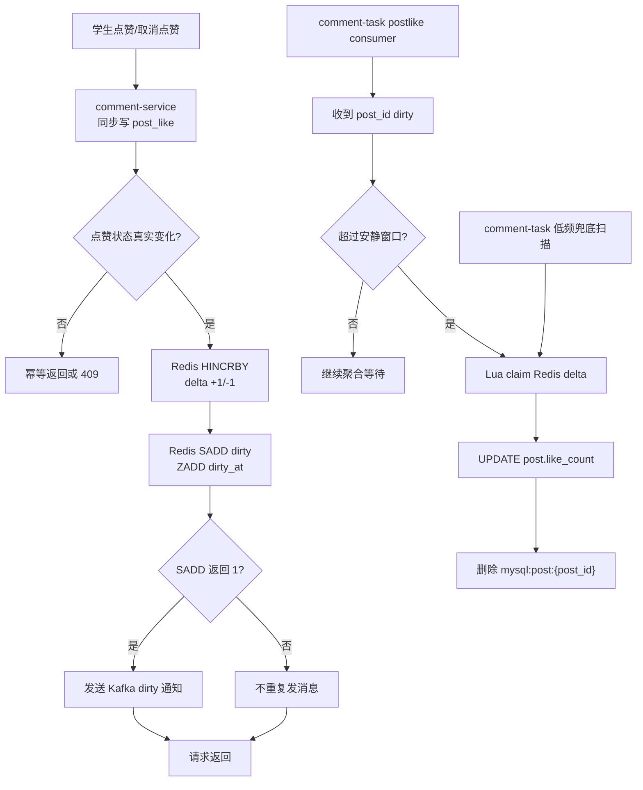

# 帖子点赞计数异步落库设计

本文说明热点帖子点赞/取消点赞的最终设计：**MySQL 同步保存点赞关系，Redis 聚合计数变化，Kafka 负责唤醒后台任务，comment-task 异步批量更新 `post.like_count`**。

核心目标：

- `post_like` 是事实表，请求内同步写，保证“某个学生是否点赞”准确。
- `post.like_count` 是冗余计数，不在请求内同步写，避免热点帖子行锁竞争。
- Redis 保存 `+1/-1` 聚合 delta，并用 dirty set 去重，用 dirty_at 延迟刷库削峰。
- Kafka 的 `postlike` topic 只发送“这个 post_id 脏了”的通知，不承载真实计数。
- `comment-task` 消费 Kafka 后从 Redis claim 聚合 delta 并落库。
- 低频 Redis dirty set 扫描作为兜底，补偿 Kafka 发送失败或消息丢失。

## 1. 背景问题

原实现每次真实点赞/取消点赞都会同步更新 `post.like_count`：

```sql
UPDATE post
SET like_count = like_count + 1
WHERE post_id = ?;
```

当大量用户集中操作同一个帖子时，请求会争抢 `post` 表同一行锁，容易出现：

- `context deadline exceeded`
- MySQL `1213 deadlock`
- MySQL `1205 lock wait timeout`

所以改造后，请求链路只更新 `post_like` 和 Redis delta，不再同步更新 `post.like_count`。

## 2. 总体链路



为什么 `SADD=0` 不发 Kafka：

- dirty set 表示“这个 `post_id` 仍有未被 task claim 的 pending delta”。
- 只要 `post_id` 还在 dirty set，说明已有 Kafka 通知或兜底扫描会处理它。
- 后续点赞/取消点赞只需要继续 `HINCRBY` 聚合 delta，不需要重复通知。

## 3. Redis 数据结构

| key | 类型 | 作用 |
| --- | --- | --- |
| `counter:post_like:delta` | Hash | field 是 `post_id`，value 是聚合 delta；点赞 `+1`，取消点赞 `-1` |
| `queue:post_like:dirty` | Set | 保存待处理 `post_id`；同一帖子同一轮 dirty 周期只保留一次 |
| `queue:post_like:dirty_at` | ZSet | member 是 `post_id`，score 是最后一次点赞/取消点赞时间；task 只刷超过安静窗口的帖子 |

核心代码：

```go
const (
	postLikeCountDeltaKey = "counter:post_like:delta"
	postLikeCountDirtyKey = "queue:post_like:dirty"
	postLikeCountDirtyAtKey = "queue:post_like:dirty_at"
)

func (d *Data) enqueuePostLikeCountDelta(ctx context.Context, postID, delta int64) error {
	if d.cache == nil || delta == 0 {
		return nil
	}

	postIDText := strconv.FormatInt(postID, 10)
	pipe := d.cache.TxPipeline()
	pipe.HIncrBy(ctx, postLikeCountDeltaKey, postIDText, delta)
	dirtyAdded := pipe.SAdd(ctx, postLikeCountDirtyKey, postIDText)
	pipe.ZAdd(ctx, postLikeCountDirtyAtKey, redis.Z{
		Score:  float64(time.Now().UnixMilli()),
		Member: postIDText,
	})
	_, err := pipe.Exec(ctx)
	if err != nil {
		return err
	}

	if dirtyAdded.Val() == 1 {
		if err := d.notifyPostLikeCountDirty(ctx, postID); err != nil {
			d.log.WithContext(ctx).Warnf("notify post like count dirty failed, post_id=%d, err=%v", postID, err)
		}
	}
	return nil
}
```

代码位置：

- `comment-service/internal/data/post_like_counter.go`

## 4. Kafka dirty 通知

Kafka 消息只表示“这个帖子脏了”，真实 delta 不放在 Kafka 里。

该消息使用独立 topic：`postlike`。原来的 `comment-service` topic 继续留给 Canal 数据库变更同步，避免点赞计数 dirty 消息和 Canal row change 混在一起。

如果 Kafka 容器关闭了自动创建 topic，需要先创建 `postlike`；本地默认 broker 是 `localhost:9092`。

消息格式：

```json
{
  "type": "post_like_count_dirty",
  "post_id": "16966883282522112"
}
```

service 侧 Kafka writer：

```go
const (
	postLikeDirtyEventType       = "post_like_count_dirty"
	defaultPostLikeDirtyTopic    = "postlike"
	defaultPostLikeDirtyBrokers  = "localhost:9092"
	postLikeDirtyNotifyTimeout   = 100 * time.Millisecond
)

type postLikeDirtyMessage struct {
	Type   string `json:"type"`
	PostID string `json:"post_id"`
}

type postLikeDirtyWriter struct {
	writer *kafka.Writer
	log    *log.Helper
}
```

创建 writer：

```go
func newPostLikeDirtyWriterFromEnv(logger log.Logger) *postLikeDirtyWriter {
	if strings.EqualFold(os.Getenv("POST_LIKE_COUNT_KAFKA_DISABLED"), "true") {
		return nil
	}

	brokers := splitCSV(firstNonEmpty(
		os.Getenv("POST_LIKE_COUNT_KAFKA_BROKERS"),
		os.Getenv("KAFKA_BROKERS"),
		defaultPostLikeDirtyBrokers,
	))
	topic := firstNonEmpty(os.Getenv("POST_LIKE_COUNT_KAFKA_TOPIC"), defaultPostLikeDirtyTopic)

	return &postLikeDirtyWriter{
		writer: &kafka.Writer{
			Addr:         kafka.TCP(brokers...),
			Topic:        topic,
			Balancer:     &kafka.Hash{},
			RequiredAcks: kafka.RequireOne,
		},
		log: log.NewHelper(log.With(logger, "module", "data/post_like_dirty_kafka")),
	}
}
```

发送通知：

```go
func (w *postLikeDirtyWriter) Notify(ctx context.Context, postID int64) error {
	if w == nil || w.writer == nil {
		return nil
	}

	postIDText := strconv.FormatInt(postID, 10)
	payload, err := json.Marshal(postLikeDirtyMessage{
		Type:   postLikeDirtyEventType,
		PostID: postIDText,
	})
	if err != nil {
		return err
	}

	notifyCtx, cancel := context.WithTimeout(ctx, postLikeDirtyNotifyTimeout)
	defer cancel()

	return w.writer.WriteMessages(notifyCtx, kafka.Message{
		Key:   []byte(postIDText),
		Value: payload,
	})
}
```

环境变量：

| 环境变量 | 作用 |
| --- | --- |
| `POST_LIKE_COUNT_KAFKA_DISABLED=true` | 关闭 Kafka 通知，只保留 Redis dirty set 兜底 |
| `POST_LIKE_COUNT_KAFKA_BROKERS` | Kafka broker 列表，逗号分隔 |
| `KAFKA_BROKERS` | 通用 Kafka broker 兜底配置 |
| `POST_LIKE_COUNT_KAFKA_TOPIC` | dirty 通知 topic，默认 `postlike` |
| `POST_LIKE_COUNT_KAFKA_GROUP_ID` | task 侧 postlike 消费组，默认 `comment-task-postlike` 或 `{kafka.group_id}-postlike` |

代码位置：

- `comment-service/internal/data/post_like_dirty_kafka.go`
- `comment-service/internal/data/data.go`

## 5. 点赞写链路

点赞请求仍然同步写 `post_like`，但不直接更新 `post.like_count`。

规则：

1. Redis 短锁收敛同一学生同一帖子的重复请求。
2. 用单条 upsert 处理新增、恢复取消、重复点赞。
3. 如果已经 `status=1`，upsert 为 no-op，幂等返回，不增加计数。
4. 如果新增或 `status=0 -> 1`，认为状态真实变化。
5. 真实变化后写 `delta=+1`。

核心代码：

```go
func (r *studentRepo) LikePost(ctx context.Context, studentID, postID int64) error {
	unlock, err := r.lockPostLike(ctx, studentID, postID)
	if errors.Is(err, errPostLikeLockBusy) ||
		errors.Is(err, context.Canceled) ||
		errors.Is(err, context.DeadlineExceeded) {
		return err
	}
	if err == nil {
		defer unlock()
	}

	changed, err := r.runPostLikeWriteWithRetry(ctx, "like", studentID, postID, func() (bool, error) {
		result := r.data.q.PostLike.WithContext(ctx).UnderlyingDB().Exec(`
INSERT INTO post_like (post_id, student_id, status)
VALUES (?, ?, 1)
ON DUPLICATE KEY UPDATE
	status = IF(status = 0, 1, status),
	updated_at = IF(status = 0, CURRENT_TIMESTAMP, updated_at)
`, postID, studentID)
		if result.Error != nil {
			return false, result.Error
		}

		return result.RowsAffected > 0, nil
	})
	if err != nil {
		return err
	}

	if changed {
		return r.recordPostLikeCountDelta(ctx, postID, 1)
	}
	return nil
}
```

## 6. 取消点赞写链路

取消点赞同样走异步计数。

规则：

1. Redis 短锁收敛同一学生同一帖子的并发取消。
2. 只有 `status=1 -> 0` 算真实取消成功。
3. `RowsAffected=0` 表示未点赞或重复取消，返回 `POST_NOT_LIKED`。
4. 真实取消后写 `delta=-1`。
5. 不同步执行 `post.like_count - 1`。

核心代码：

```go
func (r *studentRepo) UnlikePost(ctx context.Context, studentID, postID int64) error {
	unlock, err := r.lockPostLike(ctx, studentID, postID)
	if errors.Is(err, errPostLikeLockBusy) ||
		errors.Is(err, context.Canceled) ||
		errors.Is(err, context.DeadlineExceeded) {
		return err
	}
	if err == nil {
		defer unlock()
	}

	changed, err := r.runPostLikeWriteWithRetry(ctx, "unlike", studentID, postID, func() (bool, error) {
		result := r.data.q.PostLike.WithContext(ctx).UnderlyingDB().Exec(`
UPDATE post_like
SET status = 0, updated_at = CURRENT_TIMESTAMP
WHERE post_id = ? AND student_id = ? AND status = 1
`, postID, studentID)
		if result.Error != nil {
			return false, result.Error
		}
		if result.RowsAffected == 0 {
			return false, biz.ErrPostNotLiked
		}
		return true, nil
	})
	if err != nil {
		return err
	}

	if changed {
		return r.recordPostLikeCountDelta(ctx, postID, -1)
	}
	return nil
}
```

代码位置：

- `comment-service/internal/data/student.go`

## 7. 请求内只入队 delta

点赞和取消点赞最终都会走 `recordPostLikeCountDelta`。

```go
func (r *studentRepo) recordPostLikeCountDelta(ctx context.Context, postID, delta int64) error {
	if err := r.data.enqueuePostLikeCountDelta(ctx, postID, delta); err != nil {
		r.log.WithContext(ctx).Warnf(
			"enqueue post like count delta failed, post_id=%d, delta=%d, err=%v",
			postID, delta, err,
		)
		return nil
	}

	_ = r.delCache(ctx, buildStudentPostCacheKey(postID))
	return nil
}
```

关键点：

- 这里没有 `UPDATE post SET like_count = ...`。
- Kafka 发送失败不会让请求失败，因为 Redis dirty set 已经保留，低频兜底扫描会处理。
- Redis 写入使用短超时；失败时记录日志但不让点赞关系请求返回 500，后续需要通过 `post_like` 事实表做计数校准。

## 8. 读路径补偿 pending delta

异步落库意味着 MySQL 中的 `post.like_count` 会短暂落后。

展示值：

```text
展示点赞数 = MySQL like_count + Redis pending delta
```

核心代码：

```go
func (d *Data) pendingPostLikeCountDelta(ctx context.Context, postID int64) int64 {
	if d.cache == nil {
		return 0
	}

	delta, err := d.cache.HGet(ctx, postLikeCountDeltaKey, strconv.FormatInt(postID, 10)).Int64()
	if err == nil {
		return delta
	}
	if err != redis.Nil {
		d.log.WithContext(ctx).Warnf("get pending post like count delta failed, post_id=%d, err=%v", postID, err)
	}
	return 0
}

func (d *Data) applyPendingPostLikeCountDelta(ctx context.Context, post *model.Post) {
	if post == nil {
		return
	}

	delta := d.pendingPostLikeCountDelta(ctx, post.PostID)
	if delta == 0 {
		return
	}

	value := int64(post.LikeCount) + delta
	if value < 0 {
		value = 0
	}
	post.LikeCount = int32(value)
}
```

## 9. comment-task 消费 postlike dirty 消息

`comment-task` 同时消费两个 Kafka topic：

- `comment-service`：Canal 数据库变更，用于同步 Elasticsearch。
- `postlike`：点赞/取消点赞计数 dirty 通知，只用于唤醒异步刷库。

这两个 topic 用两个 reader 消费，避免 Canal 消息和业务 dirty 通知相互污染。点赞和取消点赞不需要再拆 topic，因为 Kafka 消息只携带 `post_id`，真实 `+1/-1` 变化量已经聚合在 Redis `counter:post_like:delta` 中。

reader 初始化：

```go
type CanalKafkaReader struct {
	*kafka.Reader
}

type PostLikeKafkaReader struct {
	*kafka.Reader
}

func NewPostLikeKafkaReader(kafka2 *conf.Kafka) *PostLikeKafkaReader {
	r := kafka.NewReader(kafka.ReaderConfig{
		Brokers:  kafka2.Brokers,
		GroupID:  kafka2.GroupId + "-postlike",
		Topic:    "postlike",
		MaxBytes: 10e6,
	})
	return &PostLikeKafkaReader{Reader: r}
}
```

启动时：

```go
func (js *JobWorker) Start(ctx context.Context) error {
	js.log.Debug("JobWorker start...")
	js.startPostLikeCountKafkaConsumer(ctx)
	js.startPostLikeCountFallbackFlusher(ctx)

	for {
		m, err := js.kafkaReader.ReadMessage(ctx)
		if err != nil {
			return err
		}

		msg := new(Msg)
		if err := json.Unmarshal(m.Value, msg); err != nil {
			continue
		}

		// 这里只处理 Canal -> ES 消息
	}
}
```

postlike 消费循环：

```go
func (js *JobWorker) startPostLikeCountKafkaConsumer(ctx context.Context) {
	go func() {
		for {
			m, err := js.postLikeReader.ReadMessage(ctx)
			if err != nil {
				return
			}

			if err := js.handlePostLikeCountDirtyMessage(ctx, m.Value); err != nil {
				js.log.Errorf("handle post like dirty kafka message failed: %v, raw=%s", err, string(m.Value))
			}
		}
	}()
}
```

处理 dirty 消息：

```go
func (js *JobWorker) handlePostLikeCountDirtyMessage(ctx context.Context, raw []byte) error {
	var msg postLikeDirtyMessage
	if err := json.Unmarshal(raw, &msg); err != nil {
		return err
	}

	postID, err := strconv.ParseInt(msg.PostID, 10, 64)
	if err != nil || postID <= 0 {
		return fmt.Errorf("invalid post like dirty post_id=%q", msg.PostID)
	}

	_, err = js.flushPostLikeCountDeltaByPostID(ctx, msg.PostID, postID)
	return err
}
```

代码位置：

- `comment-task/internal/task/comment.go`
- `comment-task/internal/task/post_like_counter.go`

## 10. task claim 并落库

Kafka 消费和兜底扫描最终都会调用同一个方法，确保语义一致。Lua claim 会先检查 `dirty_at`，没超过安静窗口时返回 `delta=0`，继续等待下一轮。

```go
func (js *JobWorker) flushPostLikeCountDeltaByPostID(ctx context.Context, postIDText string, postID int64) (bool, error) {
	cache := js.data.Redis()

	delta, err := js.claimPostLikeCountDelta(ctx, postIDText)
	if err != nil {
		_ = cache.SAdd(context.Background(), postLikeCountDirtyKey, postIDText).Err()
		_ = cache.ZAdd(context.Background(), postLikeCountDirtyAtKey, redis.Z{
			Score:  float64(time.Now().UnixMilli()),
			Member: postIDText,
		}).Err()
		return false, err
	}
	if delta == 0 {
		return false, nil
	}

	if err := js.applyPostLikeCountDeltaToDB(ctx, postID, delta); err != nil {
		_ = js.enqueuePostLikeCountDelta(context.Background(), postID, delta)
		return false, err
	}

	_ = cache.Del(ctx, buildPostCacheKey(postID)).Err()
	return true, nil
}
```

## 11. Lua 原子 claim

Lua 把安静窗口判断、读取 delta、删除 delta、删除 dirty 标记放在一个 Redis 原子操作里。

```go
const claimPostLikeCountDeltaScript = `
local score = redis.call("ZSCORE", KEYS[3], ARGV[1])
if score and tonumber(score) > tonumber(ARGV[2]) then
	return "__not_ready__"
end
local delta = redis.call("HGET", KEYS[1], ARGV[1])
if not delta then
	redis.call("SREM", KEYS[2], ARGV[1])
	redis.call("ZREM", KEYS[3], ARGV[1])
	return 0
end
redis.call("HDEL", KEYS[1], ARGV[1])
redis.call("SREM", KEYS[2], ARGV[1])
redis.call("ZREM", KEYS[3], ARGV[1])
return delta
`

func (js *JobWorker) claimPostLikeCountDelta(ctx context.Context, postIDText string) (int64, error) {
	raw, err := js.data.Redis().Eval(ctx, claimPostLikeCountDeltaScript, []string{
		postLikeCountDeltaKey,
		postLikeCountDirtyKey,
		postLikeCountDirtyAtKey,
	}, postIDText, cutoffMillis).Result()
	if err != nil {
		return 0, err
	}

	switch v := raw.(type) {
	case int64:
		return v, nil
	case string:
		return strconv.ParseInt(v, 10, 64)
	case []byte:
		return strconv.ParseInt(string(v), 10, 64)
	default:
		return 0, fmt.Errorf("unexpected post like count delta type %T", raw)
	}
}
```

## 12. MySQL 落库

点赞和取消点赞统一使用 delta 更新。

```go
func (js *JobWorker) applyPostLikeCountDeltaToDB(ctx context.Context, postID, delta int64) error {
	if delta == 0 {
		return nil
	}

	return js.data.DB().
		WithContext(ctx).
		Exec("UPDATE post SET like_count = GREATEST(like_count + ?, 0) WHERE post_id = ?", delta, postID).
		Error
}
```

`GREATEST(like_count + ?, 0)` 的作用：

- `delta=+1`：点赞。
- `delta=-1`：取消点赞。
- 异常情况下不让 `like_count` 变成负数。

## 13. 低频兜底扫描

Kafka 是主通知通道，但存在一个边界：

```text
Redis HINCRBY/SADD 成功
Kafka 发送失败
```

这时 `post_id` 仍在 Redis dirty set 中，但没有 Kafka 消息。所以 task 保留低频兜底扫描：

```go
func (js *JobWorker) startPostLikeCountFallbackFlusher(ctx context.Context) {
	go func() {
		ticker := time.NewTicker(postLikeCountFallbackFlushInterval)
		defer ticker.Stop()

		for {
			select {
			case <-ctx.Done():
				return
			case <-ticker.C:
				_, err := js.flushPostLikeCountDeltas(ctx, postLikeCountFlushBatchSize)
				if err != nil && ctx.Err() == nil {
					js.log.Warnf("fallback flush post like count deltas failed: %v", err)
				}
			}
		}
	}()
}
```

兜底扫描逻辑只处理超过安静窗口的帖子，避免 task 在压测仍在写 `post_like` 时立刻更新父表 `post` 行：

```go
func (js *JobWorker) flushPostLikeCountDeltas(ctx context.Context, batchSize int64) (int, error) {
	cache := js.data.Redis()
	cutoffMillis := time.Now().Add(-postLikeCountFlushQuietPeriod).UnixMilli()
	postIDs, err := cache.ZRangeByScore(ctx, postLikeCountDirtyAtKey, &redis.ZRangeBy{
		Min:   "-inf",
		Max:   strconv.FormatInt(cutoffMillis, 10),
		Count: batchSize,
	}).Result()
	if err != nil {
		return 0, err
	}

	flushed := 0
	for _, postIDText := range postIDs {
		postID, err := strconv.ParseInt(postIDText, 10, 64)
		if err != nil {
			continue
		}

		ok, err := js.flushPostLikeCountDeltaByPostID(ctx, postIDText, postID)
		if err != nil {
			return flushed, err
		}
		if ok {
			flushed++
		}
	}
	return flushed, nil
}
```

## 14. 失败重试

失败处理：

- claim 失败：把 `post_id` 放回 dirty set。
- DB 落库失败：把 delta 原样写回 Redis hash，并把 `post_id` 放回 dirty set/dirty_at。
- Kafka 发送失败：不影响请求成功，依赖 dirty set 兜底扫描。

写回 Redis：

```go
func (js *JobWorker) enqueuePostLikeCountDelta(ctx context.Context, postID, delta int64) error {
	postIDText := strconv.FormatInt(postID, 10)
	pipe := js.data.Redis().TxPipeline()
	pipe.HIncrBy(ctx, postLikeCountDeltaKey, postIDText, delta)
	pipe.SAdd(ctx, postLikeCountDirtyKey, postIDText)
	pipe.ZAdd(ctx, postLikeCountDirtyAtKey, redis.Z{
		Score:  float64(time.Now().UnixMilli()),
		Member: postIDText,
	})
	_, err := pipe.Exec(ctx)
	return err
}
```

## 15. 重复取消和短锁错误映射

重复取消和短锁忙都属于业务结果，不应该映射成 500。

```go
var (
	ErrPostLikeBusy = errors.New("点赞操作过于频繁，请稍后重试")
	ErrPostNotLiked = errors.New("该帖子尚未点赞，请勿重复取消")
)
```

service 映射：

```go
func (s *StudentService) UnlikePost(ctx context.Context, req *pb.UnlikePostRequest) (*pb.UnlikePostReply, error) {
	err := s.uc.UnlikePost(ctx, req.StudentId, req.PostId)
	if err != nil {
		if errors.Is(err, biz.ErrPostNotLiked) {
			return nil, kerrors.Conflict("POST_NOT_LIKED", err.Error())
		}
		if errors.Is(err, biz.ErrPostLikeBusy) {
			return nil, kerrors.New(429, "POST_LIKE_BUSY", err.Error())
		}
		return nil, err
	}
	return &pb.UnlikePostReply{}, nil
}
```

## 16. 一致性边界

这个方案是“关系强一致，计数最终一致”：

- `post_like` 写成功后，点赞/取消事实立即成立。
- `post.like_count` 由 Redis + Kafka + task 异步推进。
- 读详情时叠加 Redis pending delta，降低用户看到旧计数的概率。
- Kafka 重复消息是允许的，claim 到 `delta=0` 会直接跳过。
- Kafka 发送失败也是允许的，dirty set 兜底扫描会补偿。
- Redis 写失败不再让关系写请求返回 500，但这意味着计数可能短暂漏 delta；以 `post_like` 为事实源做定期校准可以修复这类极端情况。

## 17. 压测验证

单热点大量点赞：

```bash
BASE_URL=$BASE_URL \
SCENARIO=like-post \
POST_ID=$HOT_POST_ID \
VUS=30 \
DURATION=20s \
MAX_P95_MS=1500 \
MAX_P99_MS=3000 \
REQUEST_ID_PREFIX=like-many \
k6 run tools/k6/comment-service.js
```

单热点大量取消点赞：

```bash
BASE_URL=$BASE_URL \
SCENARIO=unlike-post \
POST_ID=$HOT_POST_ID \
VUS=30 \
DURATION=20s \
ALLOW_BUSINESS_ERRORS=true \
MAX_P95_MS=1500 \
MAX_P99_MS=3000 \
REQUEST_ID_PREFIX=unlike-many \
k6 run tools/k6/comment-service.js
```

SQL 反查：

```sql
SELECT p.post_id,
       p.like_count,
       COUNT(pl.id) AS active_like_count,
       p.like_count - COUNT(pl.id) AS diff
FROM post p
LEFT JOIN post_like pl
  ON pl.post_id = p.post_id AND pl.status = 1
WHERE p.post_id = ?
GROUP BY p.post_id, p.like_count;
```

期望：

- 不出现 `context deadline exceeded`。
- 不出现因同步更新 `post.like_count` 导致的 MySQL `1213/1205`。
- 重复取消可以返回 409，短锁忙可以返回 429，但不应出现 500。
- task 刷库完成后 `diff = 0`。

## 18. 文件清单

| 项目 | 文件 | 作用 |
| --- | --- | --- |
| comment-service | `internal/data/student.go` | 点赞/取消点赞关系写入、delta 入队 |
| comment-service | `internal/data/post_like_counter.go` | Redis delta 聚合、dirty 去重、读路径补偿 |
| comment-service | `internal/data/post_like_dirty_kafka.go` | Kafka dirty 通知生产者 |
| comment-service | `internal/service/student.go` | 重复取消和短锁错误映射 |
| comment-task | `internal/task/comment.go` | 启动 Canal reader、postlike reader 和兜底扫描 |
| comment-task | `internal/task/post_like_counter.go` | Kafka 消费处理、Redis claim、MySQL 落库、兜底扫描 |
| comment-task | `internal/data/data.go` | task 侧 MySQL/Redis 资源 |
