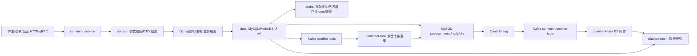

# comment-service 项目设计与面试说明

这份文档回答一个核心问题：作为开发者，为什么这个评论服务要这样设计。

可以把它当成面试自述主线：先讲业务目标，再讲技术选型、表结构、核心链路、缓存、ES、并发一致性、异常处理和压测验证。

## 1. 项目定位

`comment-service` 是一个面向知识帖的评论服务，覆盖三类角色：

| 角色 | 核心能力 | 设计关注点 |
| --- | --- | --- |
| 学生端 | 搜索帖子、看帖、点赞、评论、删除自己的评论 | 读多写少、体验要快、不能看到不可见评论 |
| 助教端 | 发布帖子、编辑帖子、删除帖子、回复评论、管理自己帖子下评论 | 权限边界清楚，不能操作别人帖子 |
| 运营端 | 查看待审核评论、查看审核上下文、审核通过或驳回 | 状态流转准确，重复审核要被拦住 |

一句话介绍：

> 我做的是一个知识帖评论服务。整体使用 Kratos 的 service/biz/data 三层组织代码，MySQL 作为强一致事实源，Redis 做热点读缓存和并发保护，Elasticsearch 做搜索查询模型。写链路优先保证准确，读链路通过缓存、Bloom Filter 和 singleflight 降低 MySQL/ES 压力。

## 2. 技术选型

### 2.1 Go

评论服务主要是网络 IO、数据库 IO、缓存 IO，Go 的 goroutine 和网络模型适合高并发 API 服务。Go 编译成单二进制，部署简单，类型系统也适合维护 proto、DTO、数据库模型这些结构化代码。

面试可以说：

> 这个项目不是复杂算法型系统，而是高并发 IO 型微服务。Go 在并发、部署和工程简洁度上比较适合。

### 2.2 Kratos

Kratos 适合这个项目的原因：

- 原生支持 HTTP/gRPC 双协议。
- 接口由 proto 定义，结构清晰，方便生成服务代码和校验规则。
- middleware 模型适合统一接入 `recovery`、`tracing`、`accesslog`、`validate`。
- 推荐的 `service/biz/data` 分层方便讲清楚职责边界。

为什么不是只用 Gin：

| 方案 | 优点 | 不足 |
| --- | --- | --- |
| Gin | 轻量，上手快 | gRPC、proto、工程分层、统一中间件需要自己组织 |
| Kratos | 微服务工程化更完整 | 初始化和代码生成更重 |

### 2.3 MySQL

MySQL 在项目里是事实源，负责“准”：

- 点赞数、评论数、审核状态需要事务保证。
- 评论、回复、点赞天然是关系型数据。
- 删除、审核、权限校验需要读取最新状态。
- 唯一键、条件更新、RowsAffected 可以作为并发写兜底。

### 2.4 Redis

Redis 负责“快”和“抗压”：

- 帖子、评论、回复对象缓存。
- 评论列表、搜索结果短 TTL 缓存。
- Bloom Filter 拦截明显不存在的 ID，防止缓存穿透。
- singleflight 合并同 key 回源，防止缓存击穿。
- 点赞/取消点赞短锁收敛同一用户同一帖子的并发写。

### 2.5 Elasticsearch

ES 负责“搜”：

- 搜索帖子、搜索评论需要分词、相关性排序、条件过滤。
- MySQL `LIKE` 在数据量上来后不适合承载全文检索。
- ES 可以按 keyword、状态、作者、帖子等条件组合查询。

但是 ES 不适合作为事实源。ES 是近实时索引，存在同步延迟，不应该用来判断审核、删除、权限和点赞计数。

学生搜索帖子后为什么还需要查数据库：

> ES 适合先把候选帖子搜出来，但它不是强一致事实源。真正进入详情页、判断是否下架、评论数/点赞数是否最新、是否可见，都要回 MySQL/Redis 这条主链路。这样把“搜得快”和“判得准”拆开，搜索体验和数据准确性都能兼顾。

### 2.6 Canal/Kafka

搜索索引可以通过 MySQL binlog 同步到 ES：

```text
MySQL -> Canal -> Kafka -> 同步 Job -> Elasticsearch
```

项目里 Kafka 目前有两条用途：

- `comment-service` topic：承接 Canal 数据库变更，用于同步 Elasticsearch。
- `postlike` topic：承接点赞/取消点赞 dirty 通知，只唤醒 `comment-task` 刷 `post.like_count`。

这样写链路不直接依赖 ES。即使 ES 短暂不可用，MySQL 写入仍能成功，后续通过消息重试补偿索引。

### 2.7 Snowflake ID

评论、回复、帖子这类业务 ID 使用 Snowflake 思路生成，优点是：

- 服务端生成，不依赖数据库自增。
- 分布式扩展更容易。
- ID 大体有时间趋势，适合排序和排查。

## 3. 整体架构



三层职责：

| 层 | 职责 | 不该做什么 |
| --- | --- | --- |
| service | 接 proto 请求、设置默认分页、调用 usecase、组装 DTO | 不写复杂事务和权限细节 |
| biz | 业务规则、权限校验、状态机语义 | 不直接操作 Redis/MySQL |
| data | 查询、事务、缓存、ES、singleflight、短锁 | 不拼对外响应 DTO |

## 4. 数据表设计

### 4.1 post

表示知识帖主体。

核心字段：

| 字段 | 含义 |
| --- | --- |
| `post_id` | 帖子业务 ID |
| `author_id` | 助教 ID |
| `title/content` | 帖子内容 |
| `status` | 发布、下架等状态 |
| `like_count` | 点赞数冗余计数 |
| `comment_count` | 可见评论数冗余计数 |
| `deleted_at` | 软删除 |

为什么冗余 `like_count/comment_count`：

> 详情页高频读取，不能每次都 count 点赞表和评论表。`comment_count` 仍由写链路同步维护；`like_count` 在热点点赞场景下改成 Redis delta + Kafka dirty 通知 + `comment-task` 异步落库，读详情时叠加 Redis pending delta。

### 4.2 post_like

表示学生对帖子的点赞关系。

核心设计：

- `post_id + student_id` 应有唯一约束。
- `status=1` 表示已点赞，`status=0` 表示取消点赞。
- 取消后保留记录，后续点赞可以恢复状态，而不是重复插入。

并发兜底：

- Redis 短锁减少同一用户并发点赞。
- 数据库唯一键防止重复关系。
- `post_like` 是事实表，状态真实变化后只写 `like_count` 的 Redis delta。
- `post.like_count` 是冗余计数，由 `comment-task` 在安静窗口后聚合落库。

### 4.3 study_comment

表示学生评论。

核心字段：

| 字段 | 含义 |
| --- | --- |
| `comment_id` | 评论业务 ID |
| `post_id` | 所属帖子 |
| `student_id` | 评论学生 |
| `content` | 评论内容 |
| `visible_status` | 是否对学生端可见 |
| `audit_status` | 待审核、通过、驳回 |
| `manual_operator_id` | 人工审核人 |
| `manual_review_reason` | 人工审核原因 |
| `deleted_at` | 软删除 |

为什么有 `visible_status` 和 `audit_status` 两套状态：

> 审核状态表达流程，是否可见表达前台展示结果。比如待审核时可以先不可见，审核通过后可见；驳回后不可见。两个字段拆开，读链路过滤更直接，审核链路也更清楚。

### 4.4 study_comment_reply

表示助教对学生评论的回复。

回复查询通常挂在评论详情或帖子详情下，所以缓存按 `comment_id` 维度组织：

```text
mysql:comment_replies:{comment_id}
```

这样新增/删除某条回复时，只需要清理对应评论的回复列表缓存。

## 5. 核心功能设计

### 5.1 学生查看帖子详情

```text
StudentService.GetPostDetailStudent
  -> StudentUsecase.GetPostDetailStudent
  -> studentRepo.GetPostDetailWithComments
       -> GetPostByID
            -> Bloom bf:post
            -> Redis mysql:post:{post_id}
            -> singleflight
            -> MySQL post
       -> listPostCommentsStudentForDetail
            -> total 使用 post.comment_count
            -> comment_count=0 时跳过评论表
            -> Redis mysql:student:post_comments:{post_id}:{hash} 读取 comment_id 列表
            -> Redis MGET mysql:comment:{comment_id} 批量读取评论对象
            -> singleflight
            -> MySQL study_comment 当前页 items 或按 comment_id 批量补 miss
  -> StudentUsecase.GetRepliesByCommentIDs
       -> 回复列表缓存
       -> MySQL IN 批量查回复
  -> service 组装 GetPostDetailReply
```

设计点：

- 帖子对象用对象缓存，热点详情能直接命中 Redis。
- 评论分页使用短 TTL 列表 ID 缓存，评论内容复用对象缓存。
- 回复从原来的 N+1 查询改成批量查询，减少冷缓存下 DB 往返。
- 详情页仍以 MySQL/Redis 主链路为准，不直接相信 ES。

### 5.2 学生搜索帖子

```text
StudentService/SearchService
  -> SearchUsecase
  -> searchRepo
       -> Elasticsearch search post index
       -> 解析 ES _source
       -> 批量补 post_counter + Redis pending/processing delta
```

搜索链路关注召回和排序，详情链路关注准确状态。帖子搜索不再做 Redis 整页缓存，因为关键词和分页组合长尾明显，命中率低且写路径难以精准失效；普通搜索直接依赖 ES，自身结果点击后仍走帖子详情链路重新校验。

### 5.3 点赞和取消点赞

点赞链路：

```text
LikePost
  -> Redis SETNX lock:post_like:{post_id}:{student_id}
  -> MySQL 单条 upsert post_like
       -> 不存在则插入 status=1
       -> status=0 则恢复为 1
       -> 已是 status=1，幂等返回
  -> Redis HINCRBY counter:post_like:delta +1
  -> Redis SADD dirty + ZADD dirty_at
  -> 必要时发送 Kafka postlike dirty
  -> 删除 mysql:post:{post_id}
  -> Lua 校验 token 后释放锁
```

取消点赞链路：

```text
UnlikePost
  -> Redis SETNX 同一把短锁
  -> MySQL 单条 update post_like
       -> status=1 改 0
       -> RowsAffected=0 返回 409 POST_NOT_LIKED
  -> RowsAffected=1 才写 Redis delta -1
  -> Redis SADD dirty + ZADD dirty_at
  -> 删除 mysql:post:{post_id}
```

面试回答：

> 点赞是幂等状态变更，不是简单 insert。项目里用 Redis 短锁收敛同一用户同一帖子的并发请求，再用数据库唯一键和单条 upsert/update 保证点赞关系正确。`post_like` 是事实表，`post.like_count` 是冗余计数；状态真实变化后只写 Redis delta，由 Kafka `postlike` topic 唤醒 `comment-task`，task 等帖子超过安静窗口后聚合落库，避免爆款帖子所有请求抢同一行 `post`。

### 5.4 发表评论和删除评论

发表评论：

- biz 层生成评论 ID，初始化 `visible_status` 和 `audit_status`。
- data 层事务插入评论并增加 `post.comment_count`。
- 写入评论对象缓存，删除帖子对象缓存。

删除评论：

- 先校验评论归属，防水平越权。
- 事务里用 `WHERE deleted_at IS NULL` 条件更新。
- 只有 RowsAffected 为 1 且原评论可见时才扣 `comment_count`。
- 重复删除不重复扣计数。

### 5.5 助教回复评论

助教回复前需要校验：

- 评论存在。
- 评论所属帖子属于该助教。
- 评论未删除且状态允许被回复。

回复写入后清理对应 `comment_id` 的回复列表缓存，避免详情页读到旧回复。

### 5.6 运营审核评论

审核是典型状态机：

```text
AuditComment
  -> 查询评论上下文
  -> WHERE comment_id=? AND audit_status=0 AND deleted_at IS NULL 条件更新
  -> RowsAffected=1 表示审核成功
  -> RowsAffected=0 表示已经被别人审核或不存在
  -> 驳回且原评论可见时扣 post.comment_count
  -> 删除 comment/post 缓存
```

面试回答：

> 审核并发不能只靠 biz 层先查状态，最终要把 `audit_status=0` 放进 update 条件。这样两个运营同时点审核时，只有一个请求能更新成功，另一个会通过 RowsAffected 发现已经被处理。

## 6. 缓存设计

缓存设计的完整版本见 [缓存设计说明](cache-design.md)。这里保留面试时最常讲的主线。

| 缓存类型 | 示例 key | TTL | 作用 |
| --- | --- | --- | --- |
| 帖子对象 | `mysql:post:{post_id}` | 10 分钟 ±10% | 详情页热点读 |
| 评论对象 | `mysql:comment:{comment_id}` | 10 分钟 ±10% | 评论详情、删除校验 |
| 回复列表 | `mysql:comment_replies:{comment_id}` | 10 分钟 ±10% | 评论详情/帖子详情复用 |
| 评论列表 ID | `mysql:student:post_comments:{post_id}:{hash}` | 2 分钟 ±10% | 某个帖子某一页的 comment_id 列表和 total |
| 评论搜索结果 | `es:comment_search:{hash}` | 2 分钟 ±10% | 评论搜索重复查询加速 |
| 空值缓存 | 同对象 key | 30 秒 ±10% | 防缓存穿透 |
| Bloom | `bf:post` / `bf:comment` | 常驻 | 拦截明显不存在 ID |
| 短锁 | `lock:post_like:{post_id}:{student_id}` | 秒级 | 收敛点赞并发 |

### 6.1 为什么写路径只删缓存

对象缓存包含计数、状态、内容，写操作影响明确，所以写成功后只删除受影响缓存，不主动写入新缓存。下一次读请求如果确实需要这条数据，会回源 MySQL，再把读到的数据写入 Redis。

这样做有两个好处：

- 写链路更短，发表评论、回复、审核时不用额外做 JSON 序列化和 Redis SET。
- 避免把“刚写入但未必会被读取”的数据预热进缓存，减少无效缓存和一致性风险。

### 6.2 为什么列表缓存删除而不是修改

评论列表缓存不是把某个帖子的所有评论都塞进一条 Redis，也不再把整页评论对象塞进一条 Redis，而是按查询参数生成 key，一条 key 对应一页 `comment_id` 列表和 total，例如 `post_id + page_num + page_size`。

读取流程：

```text
Redis GET mysql:student:post_comments:{post_id}:{hash}
  -> 命中 comment_ids
  -> Redis MGET mysql:comment:{comment_id}
  -> 部分 comment 对象 miss
  -> MySQL SELECT study_comment WHERE comment_id IN (...)
  -> 回填 mysql:comment:{comment_id}
  -> 按 comment_ids 顺序组装返回
```

这样做的好处是评论对象缓存可以被评论详情、帖子详情、评论列表复用，列表缓存 value 也更小。

学生、助教、运营三端的评论列表都采用同一套结构：

```text
列表缓存: version + comment_ids + total
对象缓存: mysql:comment:{comment_id}
链路追踪: redis.MGET mysql:comment + app.role 区分角色
```

也就是说，三端列表 key 不一样，因为查询条件和权限边界不一样；但评论对象 key 是同一个，因为单条评论事实源相同，可以复用对象缓存。

写操作处理列表缓存时只做删除，不做修改：

- 发表评论：删除该 `post_id` 的帖子评论列表、该 `student_id` 的我的评论列表、运营待审核列表。
- 删除评论：删除该 `post_id` 的帖子评论列表、该 `student_id` 的我的评论列表、对应审核状态列表。
- 审核评论：删除审核列表；如果驳回导致评论不可见，再删除帖子评论列表。

原因是列表缓存里有排序、分页和 total。新增一条评论时，如果直接往第一页追加 ID，后面的分页边界会变化；删除或审核时也可能影响多页。手动改缓存很容易让 `comment_ids`、`total` 和 DB 不一致。正确做法是删除相关列表 ID 缓存，让下一次查询从 MySQL 重新加载。TTL 继续保留，只作为异常兜底和历史 key 过期。

另一个限制是大分页。如果 `page_size` 设置过大，虽然列表 key 只存 ID，但一次 MGET 和返回 DTO 仍会变大，所以接口限制 `page_size <= 100`，压测也要观察大分页。

### 6.3 缓存穿透、击穿、雪崩

| 问题 | 处理 |
| --- | --- |
| 穿透 | Bloom Filter + 空值缓存 |
| 击穿 | Redis 未命中后用 singleflight 合并回源 |
| 雪崩 | 对象/列表/搜索 TTL 区分，并在读路径回填缓存时加入 ±10% 随机抖动 |
| Redis 故障 | 核心链路降级回 MySQL/ES，日志告警，延迟上升但不直接崩 |

## 7. ES 查询设计

ES 索引建议拆成帖子索引和评论索引：

| 索引 | 适合查询 |
| --- | --- |
| post index | 学生搜帖子、助教搜自己的帖子 |
| comment index | 助教搜帖子下评论、运营搜评论 |

帖子搜索 query 通常包含：

- `keyword` 匹配标题和内容。
- `status=1` 过滤已发布。
- `deleted_at` 为空。
- 分页和排序。

评论搜索 query 通常包含：

- `keyword` 匹配评论内容。
- `post_id` 或审核状态过滤。
- 学生端只返回可见评论。
- 运营端可按审核状态筛选。

ES 和 MySQL 一致性取舍：

> ES 允许短暂延迟，但不能影响强一致判断。搜索页可以稍微延迟，详情、删除、审核、点赞必须走 MySQL/Redis 主链路。

## 8. 并发与异常处理

| 场景 | 风险 | 当前处理 |
| --- | --- | --- |
| 同一学生并发点赞 | 重复插入、计数多加 | Redis 短锁、单条 upsert、幂等状态、唯一键兜底 |
| 不同学生点赞同一热点帖 | 抢 `post.like_count` 行锁 | Redis delta 聚合、Kafka dirty 通知、task 安静窗口异步落库 |
| 同一学生并发取消 | 计数多扣 | 条件更新 `status=1`，RowsAffected=1 才写 `delta=-1` |
| 重复删除评论 | 评论数多扣 | `deleted_at IS NULL` 条件更新，RowsAffected 兜底 |
| 多运营审核同一评论 | 重复审核、重复扣数 | `audit_status=0` 条件更新 |
| Redis 故障 | 缓存不可用、短锁不可用、计数 delta 可能丢失 | 读链路回源，写链路依赖 DB 约束兜底，计数以 `post_like` 校准 |
| ES 故障 | 搜索不可用 | 搜索明确失败，不影响详情/点赞/评论 |
| MySQL 慢查询 | P95/P99 飙升 | 索引、分页上限、缓存、压测定位 |

## 9. 代码整理结果

本轮代码整理重点：

- 抽出 `internal/service/mapper.go`，统一 DTO 组装。
- 新增 `internal/data/reply_batch.go`，详情页批量查回复，解决 N+1。
- 点赞/取消点赞增加 Redis 短锁、单条关系写、Redis delta、Kafka `postlike` 通知和 task 异步计数落库。
- 删除评论、运营审核使用事务、条件更新、RowsAffected 防并发重复处理。
- 新增 accesslog，把 `request_id`、`trace_id`、`span_id`、耗时、状态码统一记录。
- 新增 OpenTelemetry exporter 初始化和 `GetPostDetailStudent` 手动子 span。

## 10. 面试总述

可以这样完整回答：

> 这个项目是知识帖评论服务，我按学生、助教、运营三端拆接口。整体上 MySQL 是事实源，保证评论、点赞、审核这些状态准确；Redis 做热点对象缓存、列表短缓存、Bloom 防穿透、singleflight 防击穿以及点赞短锁和计数 delta；ES 做搜索查询模型，不承担强一致判断。代码按 Kratos 的 service/biz/data 分层，service 负责 DTO，biz 负责权限和状态机，data 负责事务、缓存、ES 和 Kafka 通知。并发上重点处理了点赞幂等、热点帖子点赞计数异步落库、删除评论重复扣数、运营重复审核。压测时我会分热点读、并发写和异常演练三类跑，并用 OpenTelemetry + Jaeger 查看单次请求到底慢在 service、biz、Redis、MySQL、Kafka 还是 ES。
